# Superstore BI Dashboard

**Grupo 5**

- Lizandro Mendoza
- Azul Huilahuaña
- Diego Torres
- Walter Vilca

Dashboard analítico para la cadena de suministro Superstore, construido con
**FastAPI** + **Plotly** + **PostgreSQL** siguiendo la metodología **Kimball DW/BI**.
Incluye **6 módulos de análisis** y un módulo de **Machine Learning** con 6 paneles
predictivos (clustering, asociación, regresión, forecast).

---

## Capturas de pantalla

### Overview
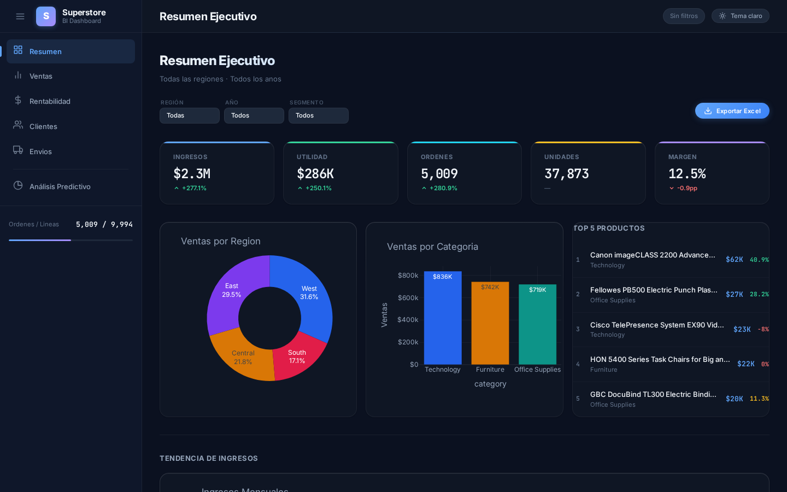

### Ventas
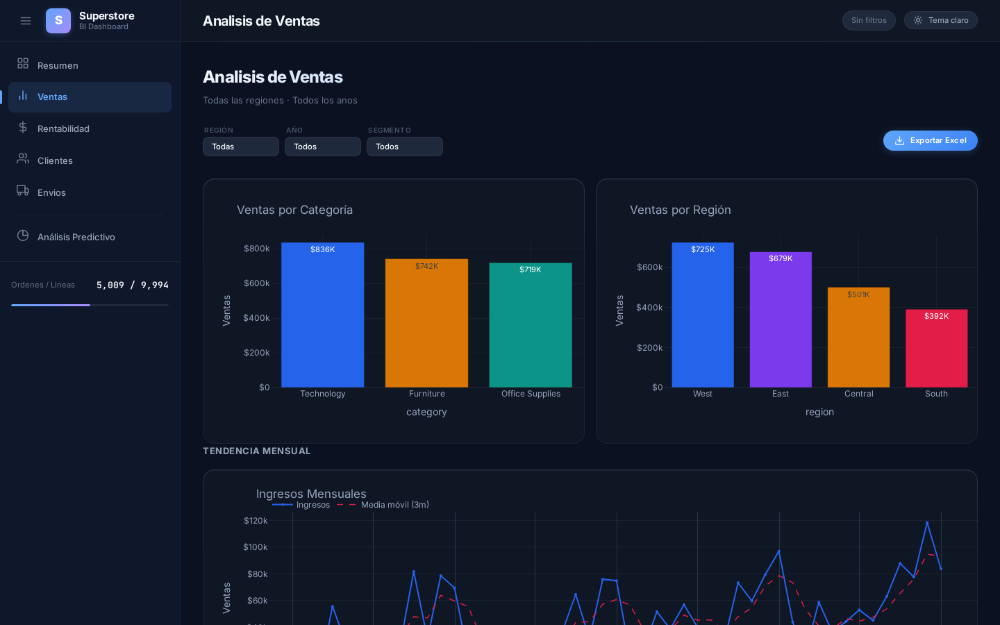

### Rentabilidad
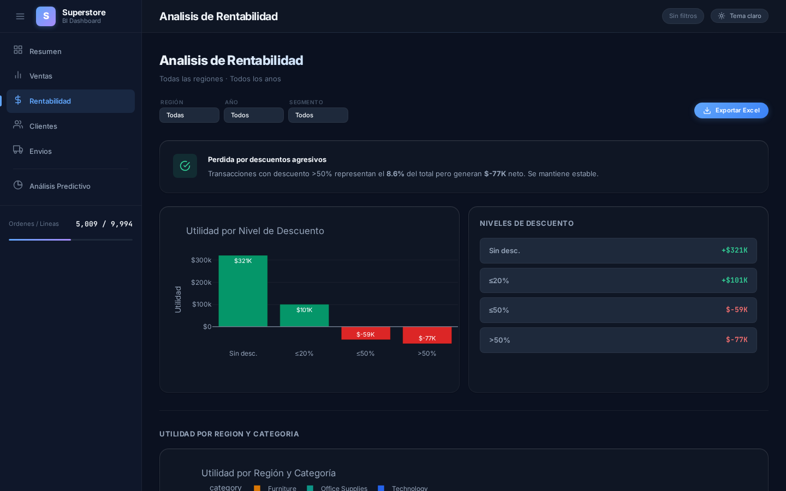

### Clientes
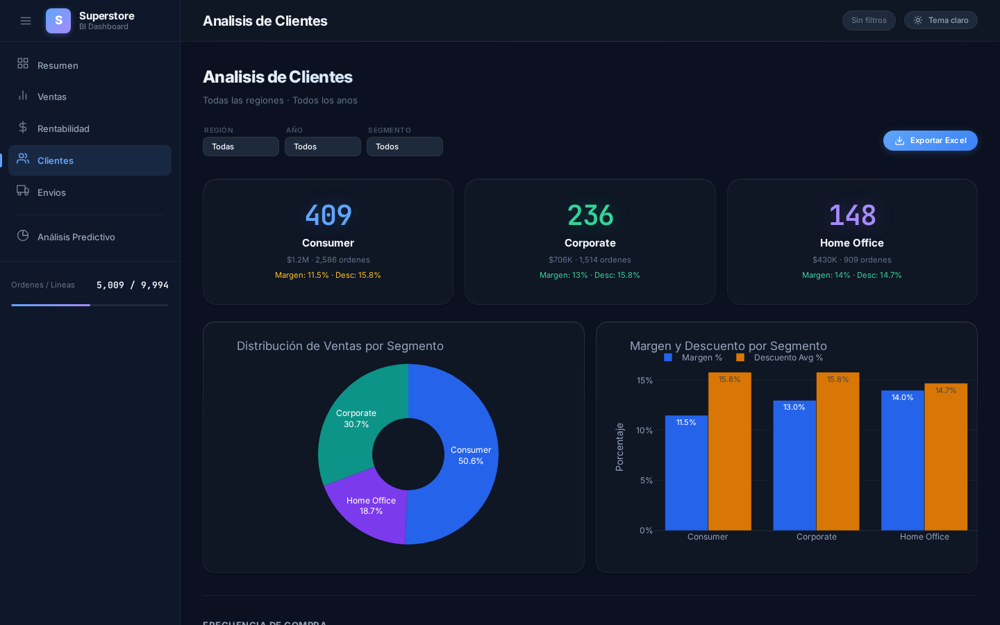

### Envíos
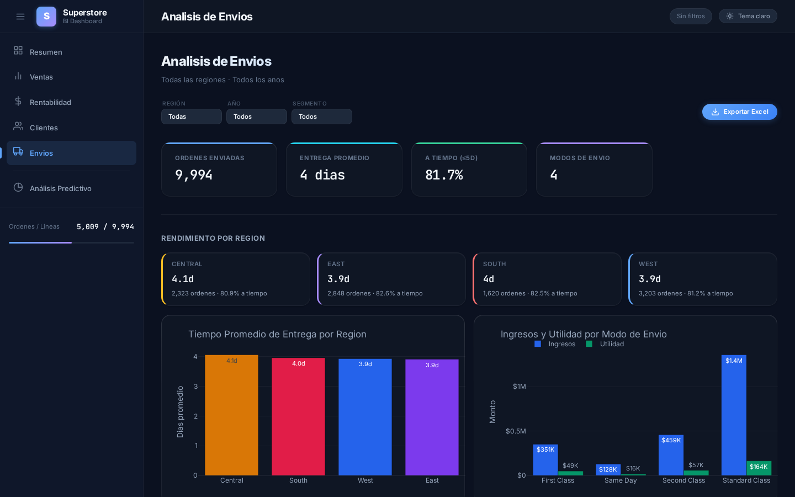

### Análisis Predictivo (ML)

#### RFM — Segmentación de clientes
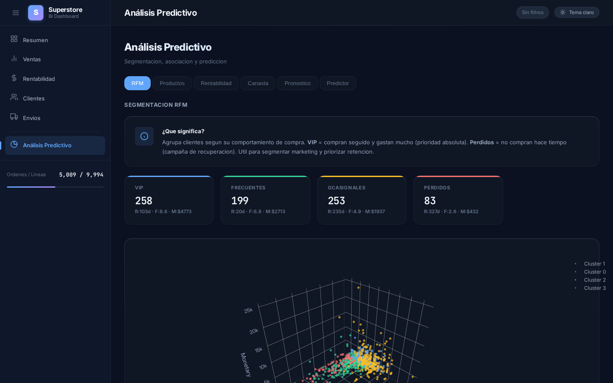

#### Productos — Clustering de productos
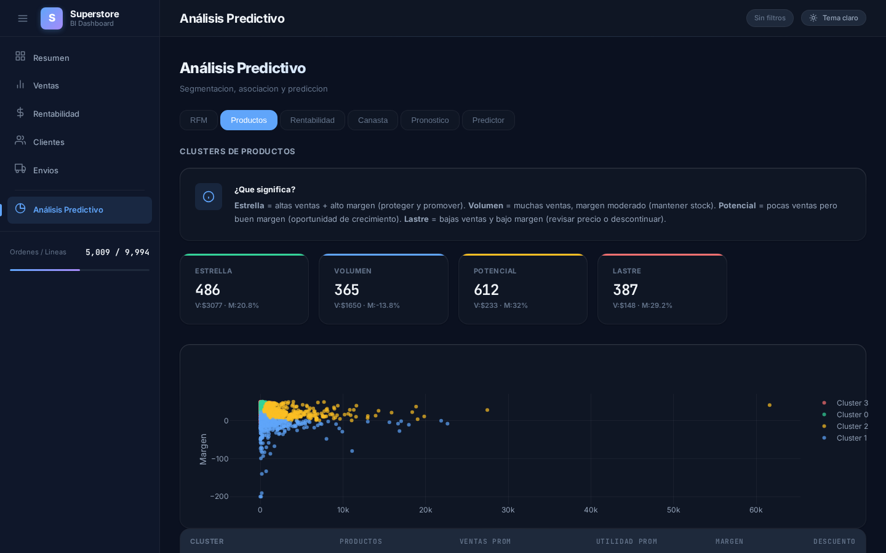

#### Rentabilidad — Mapa de calor Región × Categoría
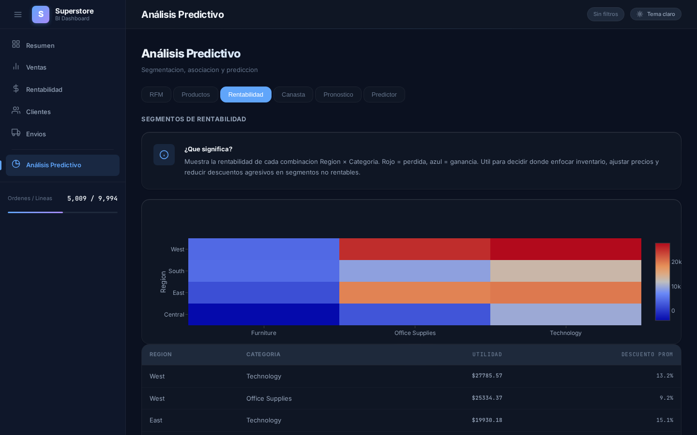

#### Market Basket — Reglas de asociación (Apriori)
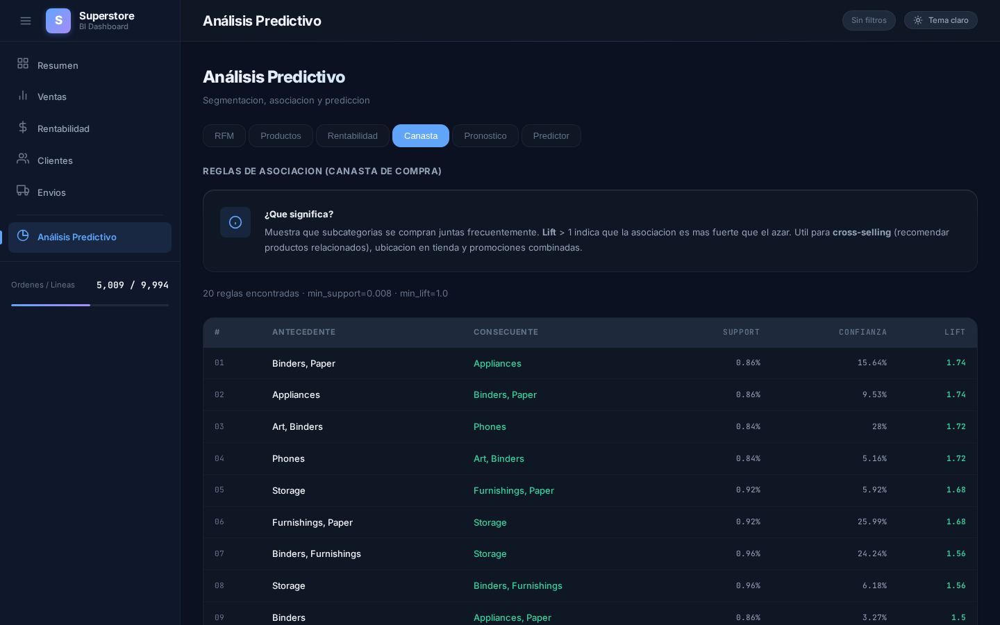

#### Pronóstico — Forecast dual ventas + utilidad
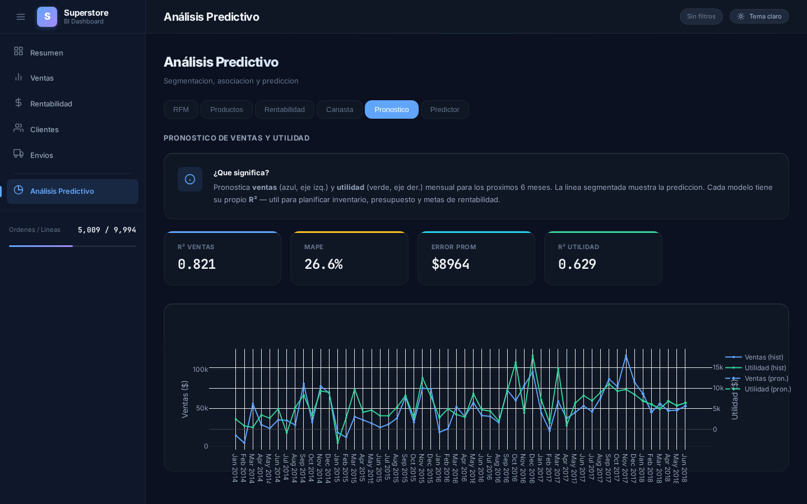

#### Predictor de Utilidad — Predicción en vivo con sliders
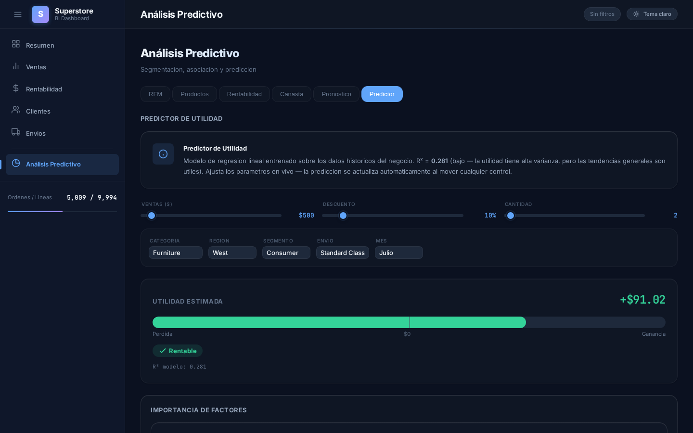

---

## Stack

| Capa       | Tecnología                     |
| ---------- | ------------------------------ |
| Backend    | Python 3.13, FastAPI, Uvicorn  |
| Frontend   | HTML, CSS, JavaScript (SPA)    |
| BD         | PostgreSQL 16                  |
| Charts     | Plotly.js                      |
| ETL        | Pandas, SQLAlchemy             |
| ML         | scikit-learn, mlxtend          |
| Export     | OpenPyXL (Excel `.xlsx`)       |

## Requisitos

- [Docker Desktop](https://docs.docker.com/desktop/setup/install/windows-install/)
  (incluye Docker Compose)

## Cómo levantar

```powershell
# 1. Clonar el repositorio
git clone https://github.com/Lizandro97/kimball-dashboard.git
cd kimball-dashboard

# 2. Iniciar todo (PostgreSQL + dashboard + ETL automático)
docker compose up -d
```

El primer arranque:
1. Construye la imagen del dashboard
2. Crea el contenedor de PostgreSQL
3. Ejecuta el pipeline ETL (extrae el CSV `data/super-store.csv`, transforma y carga las dimensiones y la tabla de hechos)
4. Inicia el servidor en `http://localhost:8000`

Las ejecuciones siguientes solo levantan los contenedores existentes (los datos persisten en un volumen Docker). La ETL solo se ejecuta al construir la imagen por primera vez o si se fuerza la recreación.

### Comandos útiles

```powershell
# Iniciar en segundo plano (detached)
docker compose up -d

# Ver logs
docker compose logs -f

# Detener contenedores (los datos persisten)
docker compose down

# Detener y borrar los datos (vuelve a estado inicial)
docker compose down -v

# Reconstruir la imagen tras cambios
docker compose build
```

## Arquitectura del proyecto

```
dashboard/
├── data/
│   └── super-store.csv        # Dataset CSV original
├── db/
│   ├── schema.sql             # DDL de referencia
│   ├── engine.py              # Conexión a PostgreSQL (singleton)
│   └── models.py              # Modelos ORM SQLAlchemy
├── etl/
│   ├── run.py                 # Orquestador
│   ├── extract.py             # Extracción CSV → raw
│   ├── transform.py           # Limpieza y transformaciones
│   └── load.py                # Carga dimensional + fact table
├── src/
│   ├── api/
│   │   ├── app.py             # FastAPI app + lifespan
│   │   ├── routes/
│   │   │   ├── overview.py, sales.py, profitability.py, customers.py, shipping.py, export.py
│   │   │   └── ml.py          # 7 endpoints ML
│   │   └── services/
│   ├── ml/
│   │   ├── clustering/
│   │   │   ├── rfm.py               # RFM K-Means
│   │   │   ├── product_clusters.py   # Product clustering
│   │   │   └── profit_segments.py    # Profitability heatmap
│   │   ├── association/
│   │   │   └── market_basket.py      # Apriori
│   │   └── regression/
│   │       ├── sales_forecast.py     # Forecast dual ventas+utilidad
│   │       └── profit_predictor.py   # Predictor transaccional
│   └── static/
│       ├── index.html         # SPA
│       ├── css/style.css      # Estilos (tema oscuro)
│       └── js/                # app.js, render.js, api.js
├── Dockerfile
├── docker-compose.yml
└── README.md
```

## Ejecución local (sin Docker)

```bash
python3 -m venv .venv
source .venv/bin/activate
pip install -e .

cp .env.example .env
# Editar .env con tu conexión PostgreSQL

python -m etl.run
uvicorn src.api.app:app --host 0.0.0.0 --port 8000
```

## Módulos del Dashboard

| Ruta              | Módulo            | KPIs principales                     |
| ----------------- | ----------------- | ------------------------------------ |
| `/#overview`      | Overview          | Ventas totales, profit, órdenes      |
| `/#ventas`        | Ventas            | Ventas por categoría, tendencias     |
| `/#rentabilidad`  | Rentabilidad      | Profit por producto/región           |
| `/#clientes`      | Clientes          | Top clientes, segmentación           |
| `/#envios`        | Envíos            | Ship modes, tiempos de entrega       |
| `/#ml`            | Análisis Predictivo | RFM, clusters, forecast, predictor |

## Módulo de Machine Learning

| Panel               | Algoritmo                | Output clave                          |
| ------------------- | ------------------------ | ------------------------------------- |
| RFM                 | K-Means (4 clusters)     | Segmentación por recencia/frecuencia  |
| Productos           | K-Means (4 clusters)     | Estrella / Volumen / Potencial / Lastre |
| Rentabilidad        | K-Means                  | Heatmap Región × Categoría            |
| Market Basket       | Apriori                  | Reglas de asociación (20 reglas)      |
| Pronóstico          | Regresión Lineal         | Forecast dual ventas + utilidad       |
| Predictor           | Regresión Lineal         | Utilidad estimada por transacción     |
